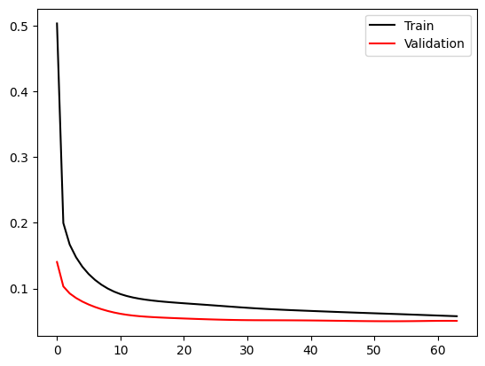
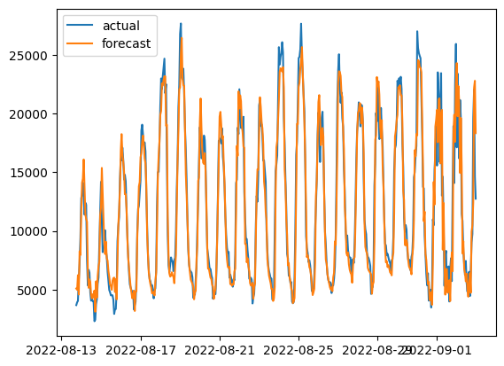
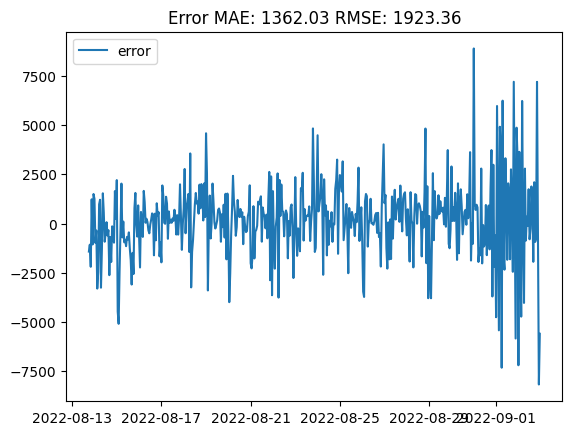
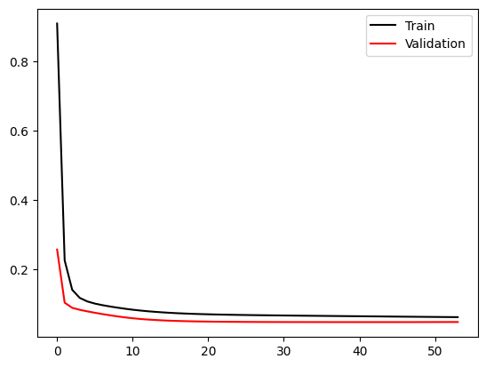
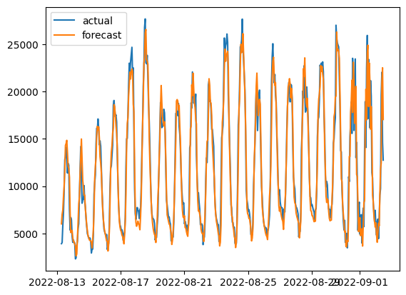
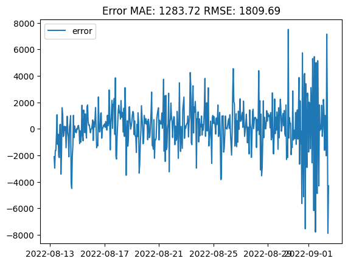
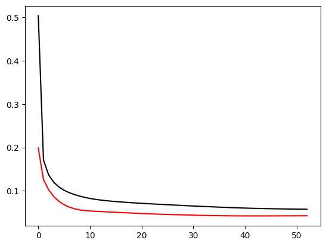

# 仙台市における人流データの予測

## 序論

## 結果
- [ARIMA Model](./analysis/01_ARIMA_model.ipynb)
- [RNN Model](./analysis/03_LSTM.ipynb)

## 謝辞
このデータは東北大学データ駆動科学・AI教育研究センターと国土交通省からご提供してくださったものであり、この研究の作者は東北大学の研究所と国土交通省にお礼を申し上げます。

## 結果
人数と気温で予測する

### 12時間

### 24時間（1日間）

### 178時間（1週間）

