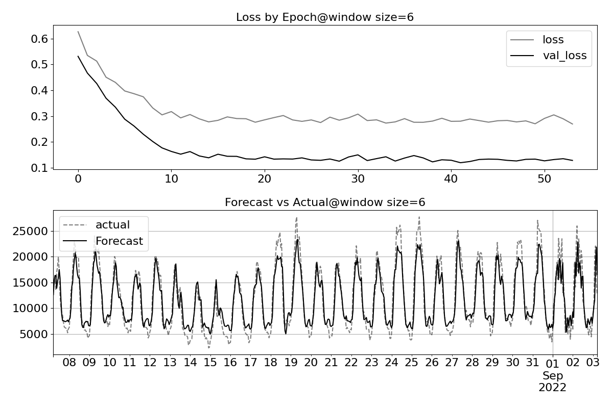
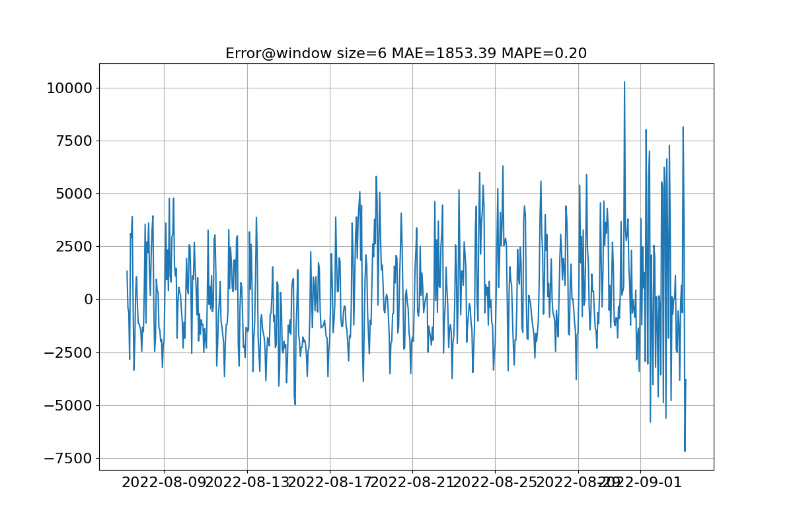

# ML_model
DCON 2024のVividFlowに使う予定のモデル

## モデルの構造
<p align='center'>
  
</p>

## 訓練結果
### 3時間前から
3時間前のp040情報に基づいて、現在の時間に人数の情報を予測する。モデルを300epcohsで訓練して、以下のようなLossグラフとそのモデルのテストのグラフを表す。
<p align='center'>
  
  
</p>

### 6時間前から
6時間前のp040情報に基づいて、現在の時間に人数の情報を予測する。モデルを300epcohsで訓練して、以下のようなLossグラフとそのモデルのテストのグラフを表す。
<p align='center'>
  
  
</p>

### 24時間前から（1日）
24時間前のp040情報に基づいて、現在の時間に人数の情報を予測する。モデルを300epcohsで訓練して、以下のようなLossグラフとそのモデルのテストのグラフを表す。
<p align='center'>
  
  
</p>

### 168時間前から（1週間）
168時間前のp040情報に基づいて、現在の時間に人数の情報を予測する。モデルを300epcohsで訓練して、以下のようなLossグラフとそのモデルのテストのグラフを表す。
<p align='center'>
  
  
</p>

## 訓練コマンド
訓練するために、必要なパラメータ

```shell
python train.py place_id window_size
```
例：
```shell
python train.py p040 6
```

## テストコマンド
テストするために、必要なパラメータ
```shell
python predict.py data_file param_file window_size
```
例：
```shell
python predict.py test.csv lstm_w6.keras 6
```

## 複数ステップの実装
予測するために、必要なパラメータ
```shell
python predict_multi.py -h                        
usage: predict_multi.py [-h] data param window_size next

positional arguments:
  data         data for prediction
  param        parameter file
  window_size  window_size
  next         how much does model have to predict
```

例：
```shell
python predict_multi.py ./num_file/p040.csv lstm_w6.keras 6 6
```

実行結果例（p040の最後の6時間のデータを基にした予測, 2022-09-03 17:00:00の分）
```shell
[[11238.119 ]
 [ 9362.437 ]
 [ 8063.7686]
 [ 7221.668 ]
 [ 6706.4756]
 [ 6352.7666]]
```
