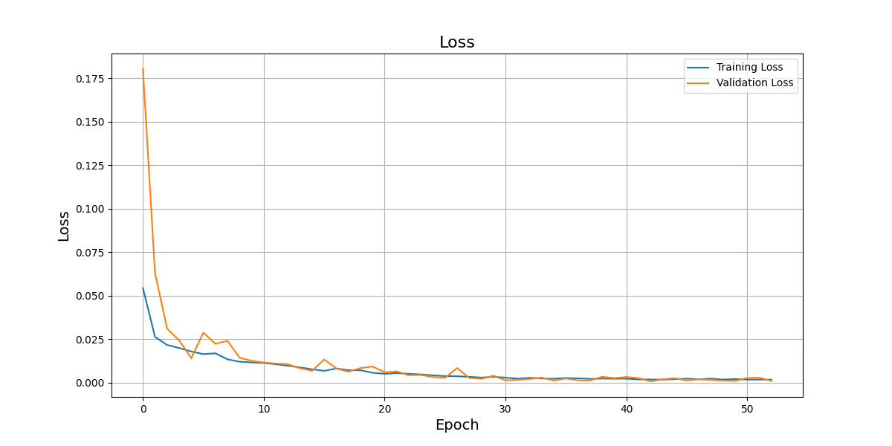
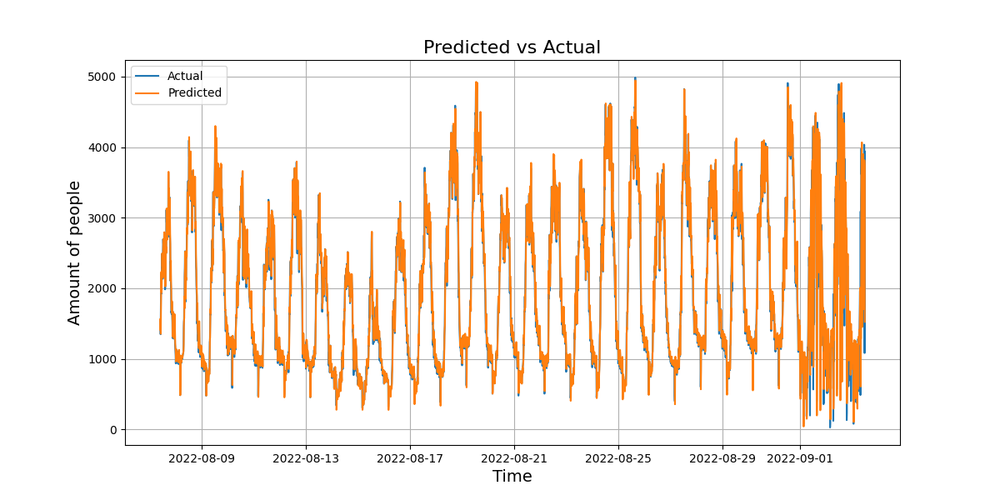

# Training using seq2seq

## Data visulaization

</img>

## Training curve
hyperparameters
- `epochs`: 100
- `batch_size`: 128
- `learning_rate`: 0.001
- `monitor`: "val_loss"
- `patience`: 10
- `loss`: "mse"
- `metrics`: ["mae"]
- `validation_split`: 0.2

## Actual vs Predict

    
    

